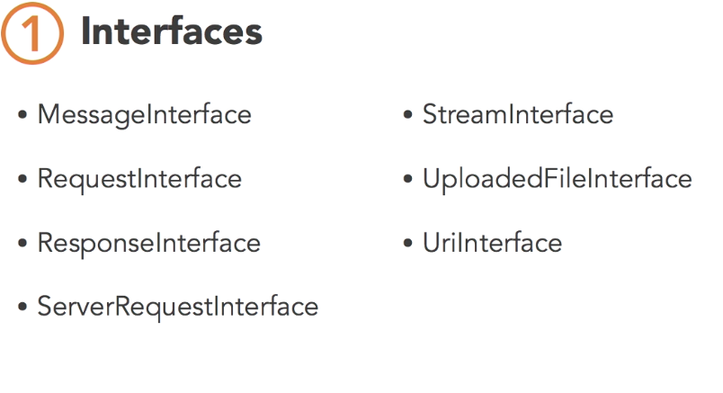

#Guzzle => PHP

##Client();
Defines the nature of requests to be made. 

     * Here's an example of creating a client using a base_uri and an array of
     * default request options to apply to each request:
     *
     *     $client = new Client([
     *         'base_uri'        => 'http://www.foo.com/1.0/',
     *         'timeout'         => 0,
     *         'allow_redirects' => false,
     *         'proxy'           => '192.168.16.1:10'
     *     ]);

	* Called in PHP file:
		$res = $client->get(
		  'posts/1'
		  );
		  
		  var_dump($res);
		  echo $res->getBody();
		  

## PSR-7
enables better collaboration across PHP tools and frameworks. 
Defines a standard interface for HTTP messages

### Interfaces
* MessageInterface 
	* Defines a common interface for HTTP requests and responses
	* Messages are immutable. Changes creates new messages
* RequestInterface
	* interface for HTTP client-side requests 
* ResponseInterface
	* interfaces for server-side response 
* ServerRequestInterface
	*  interface for server-side requests
* StreamInterface
	* interface for PHP data streams
* UploadedFileInterface
	* interface for files uploaded and revieved as part of an HTTP request 
* UriInterface
	* interface for URI 

### Middleware
